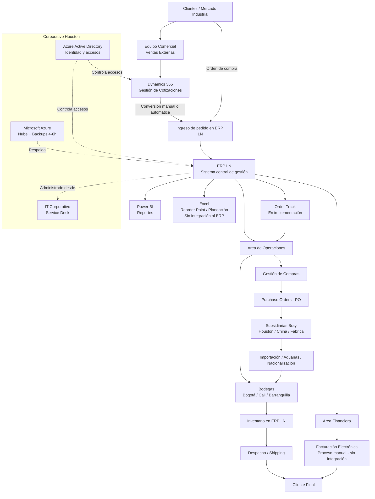

# Informe Técnico – Análisis de la Arquitectura de Infraestructura

**Equipo:** ARQTEAM-05  
**Integrantes:** Julián Barragán Pérez · Juan David González Rubio · Josue David Sarmiento  
**Cliente:** Bray Controls Andina Ltda  
**Fecha:** 2026

---

## 1. Descripción de la arquitectura actual (AS-IS)

Bray Controls Andina opera sobre una infraestructura tecnológica centralizada y provista en su totalidad por el corporativo Bray International desde Houston, Estados Unidos. La empresa no toma decisiones tecnológicas locales ni contrata servicios de tecnología de forma independiente; todo lo que usa es provisto, administrado y mantenido por el equipo global de IT corporativo.

La arquitectura sigue un modelo **empresarial por capas**, donde cada capa tiene responsabilidades claras pero con alta dependencia del corporativo para su operación y evolución.

---

### 1.1 Capa de usuarios (User Layer)

Los 45 empleados de Bray Controls Andina interactúan con los sistemas corporativos desde **equipos de cómputo autorizados y registrados** ante el Service Desk de Houston. El acceso a cualquier sistema requiere autenticación con la **cuenta de correo corporativo Microsoft** (`usuario@bray.com`).

Características clave:

- No es posible acceder a ningún sistema corporativo desde dispositivos personales ni desde redes no autorizadas.
- Cada equipo debe ser configurado y autorizado por el Service Desk corporativo antes de poder acceder a los sistemas.
- Los puertos USB están bloqueados en todos los equipos como medida de seguridad implementada tras el ataque cibernético de 2022.
- El acceso remoto desde casa no está habilitado para los empleados locales.

---

### 1.2 Capa de identidad y acceso (Identity & Access Layer)

Toda la gestión de identidades está centralizada en **Microsoft Azure Active Directory (Azure AD)**, administrado desde Houston. Esta capa es el punto de control de acceso a todos los sistemas corporativos.

Características:

- Autenticación única (SSO) mediante cuenta corporativa Microsoft.
- Al desactivar la cuenta de correo de un empleado, se revocan automáticamente todos sus accesos a todos los sistemas.
- No se evidenció uso de autenticación multifactor (MFA) — identificado como brecha de seguridad crítica.
- Los cambios de permisos y roles requieren solicitud formal al Service Desk corporativo.

---

### 1.3 Capa de aplicaciones (Application Layer)

Los sistemas de negocio que soportan la operación de Bray Controls Andina son provistos y administrados íntegramente por el corporativo. El personal local los usa pero no los administra.

| Sistema | Función | Usuarios locales | Integración |
|---------|---------|-----------------|-------------|
| **ERP LN** (Infor) | Sistema central: pedidos, inventario, compras, despachos | 37 | Sistema principal; integra operaciones y finanzas |
| **Microsoft Dynamics 365** | CRM: cotizaciones y gestión de clientes | ~22 | Integración híbrida con LN (manual + conversión automática de cotizaciones a Sales Orders) |
| **Microsoft Outlook** | Comunicación corporativa | 37 | Canal principal de coordinación entre áreas |
| **Sistema de facturación electrónica** | Facturación conforme a normativa colombiana | — | **Sin integración automática con LN** — proceso actualmente manual |
| **Order Track** | Seguimiento operativo de órdenes | 37 (previsto) | Lee datos del ERP LN; **en implementación** (kickoff 22 de mayo de 2025) |
| **Excel** | Planeación, Reorder Point, seguimiento manual | Múltiples | **Sin integración** — herramienta paralela al ERP |
| **Power BI** | Reportes y analítica | — | Conectado al ERP LN |

El punto más crítico de esta capa es la **fragmentación**: los sistemas no forman un flujo continuo e integrado. La información fluye parcialmente entre LN y Dynamics, pero la facturación electrónica y el Reorder Point dependen de procesos manuales que rompen la cadena de automatización.

---

### 1.4 Capa de datos (Data Layer)

Los datos de la empresa se almacenan en múltiples repositorios, lo que genera silos de información:

- **ERP LN:** repositorio principal de operaciones — pedidos, inventario, compras, despachos, remisiones y facturas base.
- **Microsoft Dynamics 365:** datos de clientes, cotizaciones e historial comercial.
- **Microsoft Azure:** infraestructura en nube donde se replica y respalda la información. Backups automáticos cada **4 a 6 horas** desde los dispositivos corporativos.
- **Microsoft Outlook:** correos electrónicos que funcionan como repositorio informal de acuerdos comerciales, cambios en pedidos y coordinación operativa.
- **Excel:** archivos locales con datos de Reorder Point, planeación de inventario, SMI y seguimiento de órdenes — sin control de versiones ni auditoría.

La principal debilidad de esta capa es que **no existe una fuente única de verdad**. La información de un mismo cliente o pedido puede estar distribuida en LN, Dynamics, Outlook y Excel simultáneamente, sin mecanismos de sincronización formal.

---

### 1.5 Capa de infraestructura (Infrastructure Layer)

La infraestructura física y en nube es gestionada completamente desde Houston:

- **Microsoft Azure** como plataforma principal de nube corporativa.
- Servidores locales complementarios en la sede de Tenjo (Cundinamarca).
- Backups automáticos hacia Azure cada 4 a 6 horas desde todos los equipos corporativos.
- Mantenimiento remoto del sistema cada 2 semanas o cuando Microsoft lo requiera.
- Soporte físico local a cargo de un **contratista externo** (configuración de equipos, impresoras, red local), quien también debe coordinar con el Service Desk de Houston para cualquier cambio que requiera permisos de administrador.

---

### 1.6 Capa de seguridad (Security Layer)

Los controles de seguridad son robustos pero gestionados centralmente, sin visibilidad local:

- Bloqueo total de puertos USB en todos los equipos corporativos (medida implementada tras el ataque de 2022).
- Acceso restringido a equipos autorizados por el Service Desk.
- Política corporativa de seguridad de la información (IT Information Resource Policy, firmada por el CEO Craig Brown), que cubre propiedad intelectual, contraseñas, privacidad de datos y uso de recursos tecnológicos.
- **Incidente confirmado (2022):** ataque cibernético que dejó todos los sistemas inaccesibles durante aproximadamente una semana. La respuesta fue gestionada 100% desde Houston sin participación ni protocolo local.

---

## 2. Diagrama lógico de la arquitectura

El siguiente diagrama representa los flujos reales de información entre los sistemas y actores de Bray Controls Andina, construido a partir de la información levantada en entrevistas:

---

## 3. Identificación de cuellos de botella

Un **cuello de botella** es el componente que limita el rendimiento o la continuidad del sistema. En el caso de Bray Controls Andina, los cuellos de botella no son tecnológicos en el sentido de capacidad de procesamiento, sino **estructurales y de integración**.

---

### 3.1 El Service Desk corporativo como punto único de control

Todo cambio en sistemas, permisos, configuración de equipos o respuesta ante incidentes debe pasar por el Service Desk de Houston. Esto genera:

- Tiempos de respuesta dependientes del horario y carga del corporativo.
- Incapacidad de respuesta autónoma ante fallas críticas (confirmado en el ataque de 2022).
- Bloqueo operativo ante situaciones simples: instalar una impresora requiere un ticket a Houston.

Este es el cuello de botella más crítico de la arquitectura actual porque afecta la **resiliencia de toda la operación**.

---

### 3.2 La integración manual entre LN y facturación electrónica

La factura electrónica no se genera automáticamente desde el ERP LN. El proceso es manual porque la integración no fue completada durante la última migración de versión del sistema. Esto implica:

- Reproceso de datos entre dos sistemas independientes.
- Riesgo de errores en facturación (monto, cliente, condiciones).
- Cuello de botella en el área financiera al procesar volúmenes altos de facturas.

---

### 3.3 El Reorder Point en Excel como silo de planeación

El proceso de definición del Reorder Point — que determina cuándo y cuánto se compra — vive en un archivo Excel gestionado por una sola persona. Esto genera:

- Cuello de botella operativo si esa persona no está disponible.
- Desconexión entre la planeación de compras y el ERP LN (los datos se cargan manualmente).
- Riesgo de inconsistencia entre lo que el Excel dice y lo que el ERP registra.

---

### 3.4 El ERP LN como punto único de falla operativa

Todo el proceso operativo — pedidos, inventario, compras, despachos — depende del ERP LN administrado desde Houston. Si el sistema no está disponible:

- No se pueden procesar pedidos ni consultar inventario.
- No se pueden generar remisiones ni despachar mercancía.
- No existe un plan de operación alternativa documentado.

El ataque de 2022 materializó este riesgo: una semana sin ERP equivalió a una semana sin operación.

---

## 4. Propuestas de mejora en la arquitectura

Las mejoras propuestas están organizadas por prioridad, considerando el impacto operativo y la viabilidad dado el modelo de dependencia corporativa.

---

### 4.1 Plan de continuidad operativa local (Prioridad: Alta)

Documentar un plan que establezca qué puede operarse localmente ante una caída del ERP, cómo comunicarse con Houston, cuáles son los tiempos máximos de respuesta esperados (SLA) y quién es responsable de cada acción.

Esto no requiere cambios tecnológicos — es un entregable documental y organizacional que puede implementarse de inmediato.

**Riesgo que mitiga:** cuello de botella 3.1 y 3.4.

---

### 4.2 Completar la integración LN — facturación electrónica (Prioridad: Alta)

Retomar con el equipo IT corporativo la integración pendiente entre el ERP LN y el sistema de facturación electrónica, que quedó incompleta tras la última migración de versión. Una vez integrada, el proceso de facturación se automatiza y elimina el reproceso manual.

**Riesgo que mitiga:** cuello de botella 3.2.

---

### 4.3 Migrar el Reorder Point al ERP LN (Prioridad: Alta)

Configurar el Reorder Point directamente en el módulo de inventario del ERP LN, eliminando la dependencia del archivo Excel. El LN ya tiene la capacidad de gestionar safety stock y generar sugerencias de compra automáticas — el proceso actual lo hace manualmente con datos cargados a mano.

**Riesgo que mitiga:** cuello de botella 3.3.

---

### 4.4 Activar Order Track e integrarlo al flujo operativo (Prioridad: Media)

Completar la implementación de Order Track para que el seguimiento de órdenes deje de depender de correos y Excel. Order Track lee datos del ERP LN y permite que todas las áreas (ventas, operaciones, finanzas) vean el estado de una orden en tiempo real.

**Riesgo que mitiga:** fragmentación tecnológica y falta de trazabilidad.

---

### 4.5 Implementar MFA en cuentas corporativas (Prioridad: Alta — requiere Houston)

Solicitar al IT corporativo la implementación de autenticación multifactor (MFA) en todas las cuentas de Bray Controls Andina. Dado que el ataque de 2022 pudo haber tenido como vector el compromiso de credenciales, MFA es la mitigación más directa.

**Riesgo que mitiga:** acceso no autorizado por credenciales comprometidas.

---

### 4.6 Centralizar la información de clientes en Dynamics 365 (Prioridad: Media)

Establecer Dynamics 365 como la única fuente de verdad para datos de clientes, eliminando el uso de Excel y correos como repositorios paralelos. Esto requiere un acuerdo interno de cómo se registra y actualiza la información, más que un cambio tecnológico.

**Riesgo que mitiga:** silos de datos e inconsistencia de información de clientes.

---

## 5. Relación con la arquitectura TO-BE

La arquitectura objetivo debe resolver la fragmentación actual y avanzar hacia un modelo donde el ciclo completo de una orden sea trazable en un solo sistema. Angélica (Coordinadora de Operaciones) lo sintetizó durante la entrevista:

> *"Me encantaría poder tener algo donde yo tenga todo en el mismo sistema. Eso nos hace muy poco eficientes. Tanto correo para dar una vaina de una orden. Lo que cambiaría es integrarlo: que yo pueda ver todo el proceso de una misma orden ahí mismo."*

La arquitectura TO-BE debe contemplar:

- Flujo end-to-end integrado: cotización (Dynamics) → pedido (LN) → compra (LN) → bodega (LN) → despacho (LN) → factura electrónica (integrada).
- Eliminación progresiva de Excel como herramienta operativa crítica.
- Order Track activo y adoptado por todas las áreas.
- Plan de contingencia local documentado y probado.
- Gobierno de TI local con roles, responsabilidades y SLA definidos con Houston.

---

## 6. Conclusión

La arquitectura de infraestructura de Bray Controls Andina es sólida en términos de disponibilidad y seguridad corporativa: Azure garantiza respaldo frecuente, los sistemas tienen alta disponibilidad histórica y los controles de acceso son robustos. Sin embargo, presenta debilidades estructurales significativas en integración, autonomía local y resiliencia ante incidentes.

Los principales cuellos de botella no son de capacidad tecnológica sino de **gobierno y diseño**: la dependencia total del corporativo para cualquier cambio, la fragmentación entre sistemas que obliga a procesos manuales, y la ausencia de un plan de contingencia local que permita operar ante interrupciones.

La transición hacia la arquitectura TO-BE no requiere reemplazar la infraestructura existente — requiere **completar las integraciones pendientes, documentar procesos críticos y establecer gobierno de TI local** que permita a Bray Controls Andina operar con mayor autonomía y resiliencia.

---

## Referencias

Infor. *Infor LN — Enterprise Resource Planning Documentation*.  
Microsoft. *Microsoft Azure Architecture Center*. https://docs.microsoft.com/azure/architecture  
Microsoft. *Dynamics 365 Documentation*. https://docs.microsoft.com/dynamics365  
The Open Group. *TOGAF Standard, Version 9.2*. 2018.
