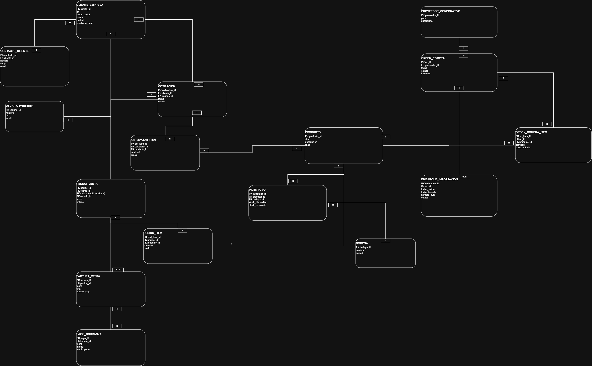

# Taller 2: Modelo de Información y Diagrama de Contexto

## Integrantes

- Julián Barragán Pérez
- Juan David González Rubio
- Josue David Sarmiento

**Cliente:** Bray Controls Andina Ltda  
**Fecha:** 2026

---

# 1. Introducción

El presente documento describe el modelo de información (ERD) y el diagrama de contexto desarrollados para Bray Controls Andina, subsidiaria corporativa de Bray International en Colombia.

Este modelo se adapta al dominio empresarial B2B de comercialización industrial de Bray Controls Andina, donde no existe fabricación local sino importación, almacenamiento, ensamble y distribución de válvulas y sistemas de control de fluidos.

El objetivo fue modelar correctamente las entidades de información y los flujos reales del proceso comercial, asegurando coherencia con la operación actual confirmada en las entrevistas con el equipo de la empresa.

---

# 2. Análisis del Dominio

Bray Controls Andina es una empresa comercializadora industrial que:

- Compra productos a subsidiarias del mismo corporativo (Bray China, Bray Houston) o directamente a fábrica.
- Mantiene inventario en **tres bodegas activas**: Bogotá (sede principal — Tenjo, Cundinamarca), Cali y Barranquilla.
- Gestiona cotizaciones a través del departamento de ventas internas mediante Microsoft Dynamics 365.
- Procesa pedidos de clientes industriales mediante el ERP LN.
- Genera órdenes de compra (PO) al corporativo cuando no hay inventario disponible o se trata de producto especial.
- Realiza seguimiento de órdenes con un aplicativo adicional (Order Track, en proceso de implementación) y Excel como herramienta paralela.
- Despacha mercancía desde sus bodegas usando el sistema FIFO (First In, First Out).
- Genera remisiones que disparan el proceso de facturación electrónica.
- Utiliza el **ERP LN** como sistema principal de gestión operativa (pedidos, inventario, compras, despachos).
- Utiliza **Microsoft Dynamics 365** como sistema CRM para cotizaciones y gestión de clientes.
- Usa un sistema adicional para **facturación electrónica** conforme a normativa colombiana.

No existe fabricación local; únicamente se realizan actividades de ensamble menor y comercialización.

---

# 3. Modelo de Información (ER)

## 3.1 Entidades Principales

### Cliente
- id_cliente (PK)
- nombre_empresa
- NIT
- direccion
- sector_industrial
- contacto_principal
- email
- telefono

---

### Producto
- id_producto (PK)
- nombre
- tipo_producto
- especificacion_tecnica
- precio_base
- estado

---

### Cotizacion
*(Registrada en Dynamics 365)*
- id_cotizacion (PK)
- fecha
- estado
- valor_estimado
- id_cliente (FK)
- id_vendedor_interno (FK)

Generada por el departamento de ventas internas en Dynamics 365. Queda vinculada al pedido cuando el cliente envía su orden de compra.

---

### Detalle_Cotizacion
- id_detalle_cotizacion (PK)
- id_cotizacion (FK)
- id_producto (FK)
- cantidad
- precio_unitario

---

### Pedido
*(Registrado en ERP LN)*
- id_pedido (PK)
- fecha
- estado
- total
- tipo_orden (warehouse / direct_delivery)
- id_cliente (FK)
- id_cotizacion (FK)

Se genera en el ERP LN cuando el cliente envía la orden de compra. El campo `tipo_orden` distingue si la mercancía sale de bodega local (warehouse) o se despacha desde otra subsidiaria directamente al cliente (direct delivery).

---

### Detalle_Pedido
*(Entidad intermedia para resolver relación N:M)*

- id_detalle (PK)
- id_pedido (FK)
- id_producto (FK)
- cantidad
- precio_unitario

---

### Orden_Compra (PO)
- id_po (PK)
- fecha
- estado
- id_pedido (FK)
- proveedor_corporativo (Bray Houston / Bray China / fábrica)
- tiempo_estimado_semanas

Se genera en el ERP LN cuando:
- El producto es especial o de configuración no estándar.
- No hay stock disponible en ninguna de las bodegas activas.
- Se requiere reposición de inventario.

El tiempo de abastecimiento varía según el origen: 8-10 semanas desde Houston, 20-22 semanas desde China, hasta 7 meses para productos de fabricación especial.

---

### Detalle_Orden_Compra
- id_detalle_po (PK)
- id_po (FK)
- id_producto (FK)
- cantidad
- costo_unitario

---

### Bodega
- id_bodega (PK)
- nombre
- ubicacion
- ciudad

La empresa opera actualmente con **tres bodegas**:
- Bodega Bogotá (Tenjo, Cundinamarca — sede principal)
- Bodega Cali
- Bodega Barranquilla

---

### Inventario
- id_inventario (PK)
- id_producto (FK)
- id_bodega (FK)
- cantidad_disponible
- posicion_fisica
- fecha_ingreso

El inventario se gestiona bajo política **FIFO** (First In, First Out). Cada ítem tiene asociada una posición física dentro de la bodega. El sistema ERP LN advierte automáticamente qué caja usar al momento del despacho.

---

### Remision
- id_remision (PK)
- fecha
- id_pedido (FK)
- estado_despacho
- id_bodega (FK)

Evento del sistema que confirma la salida de mercancía de bodega y dispara el proceso de facturación electrónica. Es el documento de transición entre operaciones y finanzas.

---

### Factura
- id_factura (PK)
- fecha
- valor_total
- estado
- id_pedido (FK)

Generada en el ERP LN y posteriormente procesada en el sistema de facturación electrónica conforme a normativa colombiana.

---

### Empleado
- id_empleado (PK)
- nombre
- cargo
- area
- email

Roles relevantes:
- Ventas externas (ingenieros de campo)
- Ventas internas (gestión de cotizaciones, precios y registro de pedidos)
- Operaciones (compras, logística, comercio exterior, bodega)
- Financiero (facturación y cobros)
- IT local (Julián David Rodríguez)

---

## 3.2 Relaciones y Cardinalidades

- Cliente 1 — N Cotizacion
- Cotizacion 1 — 0..N Pedido
- Pedido 1 — N Detalle_Pedido
- Producto 1 — N Detalle_Pedido
- Cotizacion 1 — N Detalle_Cotizacion
- Producto 1 — N Detalle_Cotizacion
- Pedido 1 — N Orden_Compra
- Orden_Compra 1 — N Detalle_Orden_Compra
- Producto 1 — N Detalle_Orden_Compra
- Producto 1 — N Inventario
- Bodega 1 — N Inventario
- Pedido 1 — 1 Remision
- Remision N — 1 Bodega
- Pedido 1 — 1 Factura
- Empleado 1 — N Cotizacion

---

# 4. Proceso Comercial Modelado

El flujo real identificado en las entrevistas es el siguiente:

1. **Solicitud de cotización:** el cliente industrial se contacta con el vendedor externo.
2. **Canalización interna:** ventas externas transmite los requerimientos a ventas internas.
3. **Elaboración de cotización:** ventas internas genera la cotización en Dynamics 365, con información de producto, precio y disponibilidad.
4. **Envío de orden de compra:** el cliente acepta y envía su orden de compra.
5. **Registro del pedido:** ventas internas registra el pedido en ERP LN y genera un documento (trailer) para operaciones.
6. **Verificación de inventario:** operaciones verifica disponibilidad en las bodegas (Bogotá, Cali, Barranquilla).
7. **Si hay inventario:** se procede al picking, alistamiento y despacho.
8. **Si no hay inventario o es producto especial:** se genera Orden de Compra (PO) al corporativo o fábrica.
9. **Recepción de mercancía:** el producto llega a bodega y se ingresa al inventario en el ERP LN.
10. **Generación de Remisión:** cuando la mercancía sale de bodega, se genera la remisión.
11. **Facturación:** la remisión dispara el proceso de facturación en el área financiera.
12. **Factura electrónica:** el departamento financiero procesa la factura en el sistema de facturación electrónica.
13. **Entrega al cliente:** el cliente recibe la mercancía y la factura.

---

# 5. Diagrama de Contexto

**Archivo:** `ERD_BRY_Andina.drawio.png`



## 5.1 Sistema Central

**ERP LN** — Sistema de Gestión Empresarial principal de Bray Controls Andina (pedidos, inventario, compras, despachos).

**Dynamics 365** — Sistema CRM para gestión de cotizaciones y clientes (vinculado al flujo del ERP LN).

---

## 5.2 Actores Internos

- Ventas Externas (ingenieros de campo)
- Ventas Internas (cotizaciones, precios y registro de pedidos)
- Operaciones (compras, logística, bodega y comercio exterior)
- Departamento Financiero (facturación y cobros)
- IT Local (soporte técnico — Julián David Rodríguez)

---

## 5.3 Actores Externos

- Cliente Industrial (empresas del sector petróleo y gas, energía, manufactura, agua, entre otros)
- Subsidiarias Corporativas (Bray China / Bray Houston)
- Fábricas de producto especial
- Sistema de Facturación Electrónica (normativa colombiana)
- Corporativo Houston (gobierno de IT y seguridad)

---

## 5.4 Flujos de Información

```
Cliente → Solicitud de cotización
Ventas Externas → Requerimiento a Ventas Internas
Ventas Internas → Cotización en Dynamics 365 → Cliente

Cliente → Orden de compra
Ventas Internas → Pedido en ERP LN → Trailer a Operaciones

Operaciones → Verificación de inventario (Bodegas: Bogotá / Cali / Barranquilla)

[Si no hay stock] → Orden de Compra (PO) → Bray Houston / Bray China / Fábrica
Corporativo/Fábrica → Confirmación y despacho → Bodega local

Operaciones → Remisión (salida de mercancía)
Remisión → Dispara proceso de facturación
ERP LN → Factura base → Sistema de Facturación Electrónica
Factura Electrónica → Cliente
```

---

# 6. Decisiones de Modelado

## 6.1 Eliminación de Producción

Se eliminó la entidad `Orden_Produccion` del modelo inicial porque Bray Controls Andina no fabrica productos; únicamente compra al corporativo o a fábricas externas y comercializa.

## 6.2 Separación de Orden de Compra

Se modeló `Orden_Compra` como entidad independiente para representar la relación comercial con subsidiarias del corporativo o fábricas externas, incluyendo el campo `tiempo_estimado_semanas` que refleja la variabilidad real del abastecimiento internacional.

## 6.3 Inventario por Bodega — Tres ubicaciones activas

Se separó `Inventario` de `Producto` para permitir control por ubicación física. El modelo contempla las tres bodegas activas de la empresa: Bogotá, Cali y Barranquilla. Esto permite escalar a nuevas bodegas sin cambios estructurales en el modelo.

## 6.4 Remisión como Evento Disparador

Se incluyó `Remision` como entidad formal porque representa el evento operativo que activa el proceso de facturación y marca la transición entre operaciones y finanzas.

## 6.5 Distinción entre ERP LN y Dynamics 365

Se modelaron como sistemas separados porque cumplen roles distintos: Dynamics 365 gestiona la relación comercial (cotizaciones y CRM) mientras que el ERP LN gestiona la operación (pedidos, inventario, compras, despachos). Ambos están interconectados en el flujo real del negocio.

## 6.6 Tipo de Orden

Se incluyó el campo `tipo_orden` en `Pedido` para diferenciar órdenes de tipo warehouse (despacho desde bodega local) y direct delivery (despacho desde otra subsidiaria directamente al cliente final), reflejando la realidad operativa de la empresa en mercados regionales como Ecuador.

---

# 7. Conclusión

El modelo desarrollado representa de manera estructurada el proceso comercial real de Bray Controls Andina, alineado con su operación como subsidiaria comercial del corporativo Bray International y con los detalles confirmados en las entrevistas con el equipo operativo y comercial.

Se aplicaron principios de normalización, separación de responsabilidades y coherencia con el dominio empresarial, logrando un modelo consistente tanto en el ERD como en el diagrama de contexto. Las tres bodegas activas, la distinción entre LN y Dynamics 365, y la variabilidad de tiempos de abastecimiento internacional quedan correctamente representadas.

---

## Licencia

Material del curso de Arquitectura Empresarial — Universidad de La Sabana. Uso académico bajo licencia MIT.
