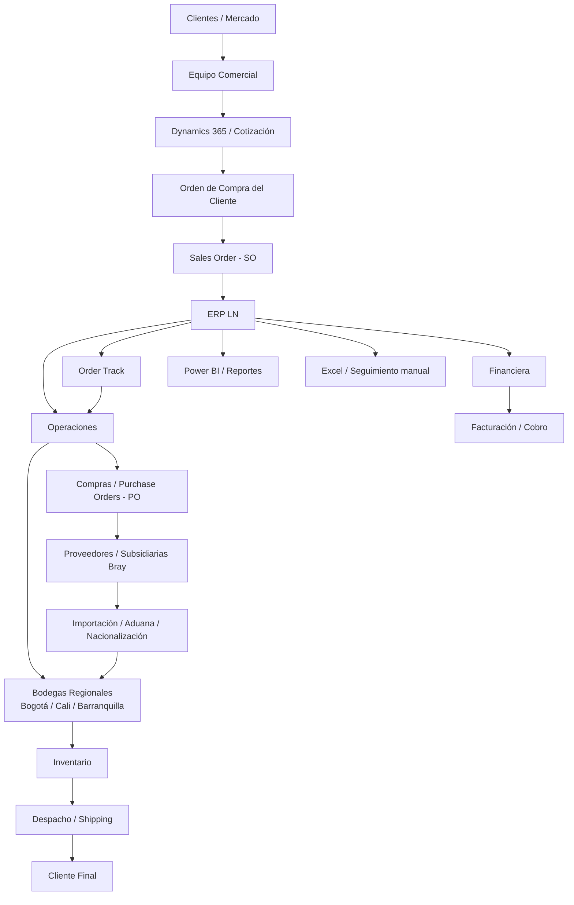

# Mapa de infraestructura del sistema real del cliente (BRY Andina)

> **Nota:** Este mapa está construido con base en la transcripción del cliente. Representa la **infraestructura lógica real del proceso operativo**: sistemas, actores, flujos de información e integraciones principales.  
> No incluye detalles de red física, marcas de servidores, IPs, puertos o nube específica porque esa información no aparece explícitamente en la entrevista.

---

## 1. Vista general

